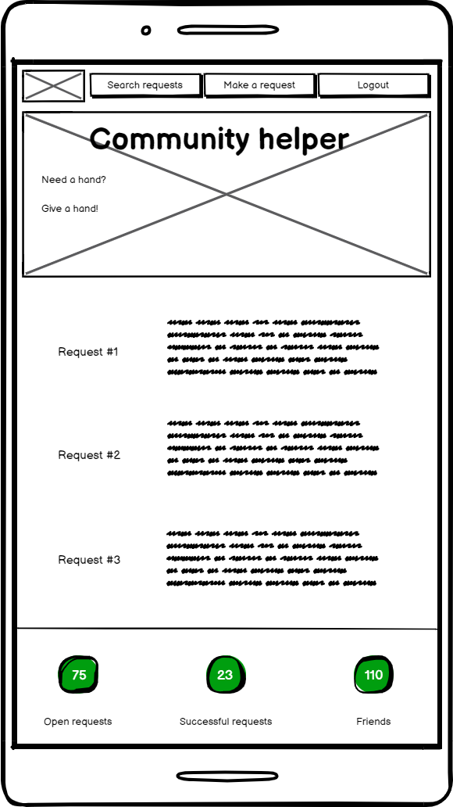
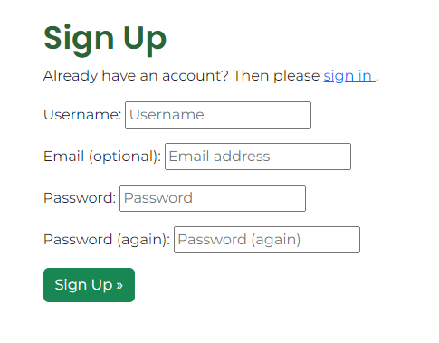
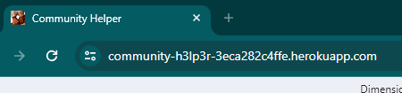

# [COMMUNITY HELPER](https://community-h3lp3r-3eca282c4ffe.herokuapp.com)

Need a hand? Have two? Or...at least one?

Let us try this again...have you ever played Stardew Valley and never got tired of bringing Willy 5 albacores in 2 days?

Well, in that case, our Community Helper is just the right thing for you.

If you need help with something, or if you can help someone, why not do it?

Simply post a task, or accept one, and you're ready to go!


## UX

### Colour Scheme

Colour scheme was kept simple, with dominant dark green being used for text on otherwise white background.

- `#286638` used for primary text.

### Typography

We have used `Poppins` and `Montserrat` fonts throughout the website to create, both, familiarity using the similarities of the fonts, but also distinction between different types of text.

Their combination shows a kind of strict playfulness that fits perfectly with what we are trying to achieve.

- [Poppins](https://fonts.google.com/specimen/Poppins) was used for the headers.

- [Montserrat](https://fonts.google.com/specimen/Montserrat) was used for all other secondary text.

- [Font Awesome](https://fontawesome.com) icons were used throughout on the homepage.

## User Stories

### New Site Users

- As a user, I can read about the website goal so that I can decide if I want to sign up.
- As a potential user, I can view how many users/requests the website has so that I know if it's a real deal before signing up.
- As a user, I can register so that I can accept or post tasks/requests.
- As a user, I can categorize my request so that I can receive help quicker.
- As a user, I can choose a deadline of my request so that I don't receive help when not needed.
- As a user, I can only choose future date for a deadline so that I don't accidentally choose a past date.
- As a user, I can submit a request so that I can receive help from the community.
- As a user, I can browse through requests so that I find a suitable one.
- As a user, I can navigate through pages of requests so that I can find a suitable one in order to accept it.
- As a user, I can see the correct date of task creation/editing so that I know when the last change was made.
- As a user, I can accept someone's request so that I can help the community.

### Mobile Users

- As a mobile user, I can click a 'go back up' button so that I can return to the top of the page instantly and not have to scroll.
- As a user using a smaller desktop screen, I can clearly see the mission statement so that I know what the page is about.

### Returning Site Users

- As a user, I can instantly recognise the Community Helper tab by it's favicon so that I avoid unnecessary clicks.
- As a user, I can login so that I can check on the progress of my task/request or accept a task/request.
- As a user, I can log out from the site so that I don't jeopardize my or someone else's information.
- As a user, I can ensure my own privacy with login being required for any sensitive areas of the website so that I can be at ease with my information and information of others.
- As a user, I can filter through requests so that I save time while looking for a suitable one.
- As a user, I can see the location of the owner so that I can decide if I want to open the task to read more about it and accept it.
- As a user, I can open an active request so that I can view it in full and decide if I want to accept it.
- As a user, I can see the same information when filtering as I would in a general task list so that I don't have to unnecessarily open all tasks to find out if they have an end date and their location.
- As a user, I can clearly see when I'm logged in so that I know to logout when necessary.
- As a user, I can navigate to a page with my active requests so that I can update them or be reminded of what needs doing.
- As a user who submitted the request, I can mark it as done so that I can keep better track of my requests.
- As a submitter/helper, I can comment on the request so that I can request an update/info.
- As a user, I can see that the comment form is visually similar to the task form so that I don't break the illusion of the brand.
- As a user who published a task, I can edit it so that I provide up to date information to a future helper.
- As a user who published a task, I can delete it so that I don't clog request list with something that is outdated/unneccessary.
- As a user, I can confirm that I want to delete my request so that I don't do it on accident.
- As a user, I can confirm that I want to mark a task as closed so that I don't do it accidentally.
- As a user, I can enter relevant information in my profile so that I don't have to repeat myself later on.
- As a user, I can see a notification that I've opened a page that doesn't exist so that I can navigate to where I actually wanted to go.

### Site Admin

- As an administrator, I can access admin panel so that I can monitor my page and edit necessary items.

## Wireframes

To follow best practice, wireframes were developed for mobile, tablet, and desktop sizes.
We've used [Balsamiq](https://balsamiq.com/wireframes) to design my site wireframes.

### Mobile Wireframes

<details>
<summary> Click here to see the Mobile Wireframes </summary>

Home
  - 

Create a Request
  - 

Ongoing Request
  - 

Request List
  - 

Open Request
  - 

</details>

### Desktop Wireframes

<details>
<summary> Click here to see the Desktop Wireframes </summary>

Home
  - 

Create a Request
  - 

Ongoing Request
  - 

Request List
  - 

Open Request
  - 

</details>

### Deviation from the Wireframes

- Footer was originally planned as a constant feature present across all pages, however, as it only serves the purpose of validating the website for newer users, we have decided to remove it in order to maximise space.
- Subheading (Need a hand? Give a hand) was ommited to preserve a cleaner look.
- Special Instructions/directions were streamlined into user profile to prevent repetition.
- Mobile version of the request list is only slightly different, in order to maximise space.
- Mobile version of the homepage does not have fontawesome icons in order to maximise space - they are, however, available for the desktop users.
- Private messages, as noted within the wireframes, were not a part of the MVP, however, comment section was added to the ongoing tasks to compensate.

## Features

We have implemented a number of features for users' benefit with security and logic at the forefront.

### Existing Features

- **Navbar**

    - Responsive navbar adjusts to the user's screen and maximises space saved all while allowing user to have everything available in up to two clicks.


- **Footer**

    - Footer displays the number of available tasks, successfully resolved tasks and a total number of users.
    - This is validating the website for a future user, all the while making current users' feel like they're contributing.


- **Homepage**

    - Homepage allows the future user to understand the goal of the website.


- **Login confirmation**

    - Login confirmation allows users to know which account they are currently using, to ensure they don't mix up their accounts.


- **Task List**

    - Clicking on `Browse Requests` opens up a list of currently available tasks sorted from oldest to the newest.
    - Available tasks display title, 150 characters of user's request, as well as task category, deadline (when applicable) and location.


- **New Task**

    - User can create their own task. Should they forget to enter value in mandatory fields, they will be reminded. 
    - If user already created their profile, it will be auto-filled, but available for changes during task-creation.


- **User Profile**

    - Clicking on `Profile`, followed by `Your Profile`, user can create or update their profile.
    - This way, the user won't necessarily need to input all their details whenever they need to  create a task.
    - If user updates their profile after creating a task, the change will be visible on the already-created task(s).


- **Own tasks**

    - Clicking on `Profile`, followed by `Check Requests`, user has access to all open tasks they have created or are helping on.
    - These tasks are separated into `Tasks you created` and `Tasks you are helping on` sections.


- **Pagination**

    - When browsing tasks, user can navigate between multiple pages easily in order to find a suitable task.


- **Task Filtering**

    - In order to facilitate quicker task-hunt, we have developed filtering option based on the task category.


- **Back To Top button**

    - When there are more than three filtered tasks on a smaller screen, back to top button is displayed.
    - Same feature is available when user is reviewing their own tasks, regardless of their number.


- **Edit Task**

    - Owner can update their task as long as there is no helper associated with it.
    - Date of update will be displayed from now on, however, task will remain sorted by the creation time to not punish the user for making changes.


- **Delete Task**

    - Owner can delete their task as long as there is no helper associated with it.


- **Ongoing task**

    - Task that has a helper but has not been archived yet is considered an ongoing one.
    - Owner and helper are the only ones with access to it, as it displays user's profile details.


- **Comment**

    - Owner and helper can comment on a task. Along the comment, they can see when the comment was made.


- **Archive Task**

    - Once the task is done, owner can archive it.
    - This task is then counted in the footer under successful requests.


- **Accept a task**

    - User who is not task owner can accept a task. 
    - This way they get access to full task details and can communicate with the owner.


- **Signup page**

    - User can register to be a part of Community Helper community.



- **Log in page**

    - User can log in.


- **Logout page**

    - User can log out.


- **Messages**

    - Messages are displayed based on users' actions in order to help with action validation or to inform them of a lack of privileges.


- **Favicon**

    - Favicon is displayed on the page tab for easy tab recognition.



- **Admin panel**

    - Admin panel is only accessible by adding /admin to the page url.


- **404 page**

    - Should user stumble upon a page that doesn't exist, they will be informed.


### Future Features

- User avatar
    - User's should be able to upload their avatar.
    - Avatar should be displated next to user's name in tasks and comments in its miniature form.
- User satisfaction
    - With time, users' will most likely get bored with the concept. At that time, we would introduce user satisfaction.
    - Task owner would be able to rate the helper. Average user rating would be displayed next to each user's name.
- Handling outdated tasks
    - Outdated tasks should either be displayed differently, or not be visible in the overall list.
    - This would, however, require to scope the number of such tasks and survey average users to understand the best approach.

## Tools & Technologies Used

- [HTML](https://en.wikipedia.org/wiki/HTML) used for the main site content.
- [CSS](https://en.wikipedia.org/wiki/CSS) used for the main site design and layout
- [CSS Flexbox](https://www.w3schools.com/css/css3_flexbox.asp) used for an enhanced responsive layout.
- [JavaScript](https://www.javascript.com) used for message display and intervention into calendar.
- [Python](https://www.python.org) used as the back-end programming language.
- [Git](https://git-scm.com) used for version control. (`git add`, `git commit`, `git push`)
- [GitHub](https://github.com) used for secure online code storage.
- [GitHub Pages](https://pages.github.com) used for hosting the deployed front-end site.
- [Gitpod](https://gitpod.io) used as a cloud-based IDE for development.
- [Bootstrap](https://getbootstrap.com) used as the front-end CSS framework for modern responsiveness and pre-built components.
- [Django](https://www.djangoproject.com) used as the Python framework for the site.
- [PostgreSQL](https://www.postgresql.org) used as the relational database management.
- [ElephantSQL](https://www.elephantsql.com) used as the Postgres database.
- [Heroku](https://www.heroku.com) used for hosting the deployed back-end site.
- [Cloudinary](https://cloudinary.com) used for online static file storage.
- [ScreenToGif](https://www.screentogif.com/) used for creation of examples for README and TESTING files.

## Database Design

This project used 4 models - Category, Task, Comment and Profile:

<details>
<summary> Click here to see the Category model </summary>

```python
class Category(models.Model):
    '''
    Category contains a name, with 7 choices.
    '''
    name = models.CharField(choices=CATEGORIES, null=False, blank=False, max_length=100)

    def __str__(self):
        return self.name

CATEGORIES = (
    ("1", "Helping the elderly"),
    ("2", "Helping the youth"),
    ("3", "Helping the people with disability"),
    ("4", "Grocery run"),
    ("5", "DIY, minor home improvements"),
    ("6", "Urgent"),
    ("7", "Other"),
    )
```

</details>


<details>
<summary> Click here to see the Task model </summary>

```python
class Task(models.Model):
    '''
    Task model used to create task.
    '''
    title = models.CharField(max_length=50)
    owner = models.ForeignKey(User, on_delete=models.CASCADE, related_name="tasker")
    description = models.TextField(max_length=2000)
    status = models.CharField(choices=STATUS, default="Draft", max_length=100)
    helper = models.ForeignKey(User, on_delete=models.CASCADE, blank=True, null=True, related_name="helper")
    created_date = models.DateTimeField(auto_now_add=True)
    updated_date = models.DateTimeField(auto_now_add=True)
    category = models.ForeignKey(Category, on_delete=models.CASCADE, related_name="sort", null=False)
    final_date = models.DateField(blank=True, null=True)

    class Meta:
        '''
        Ordering from oldest to newest.
        '''
        ordering = ['created_date']

    def __str__(self):
        '''
        Function task returns a task title.
        '''
        return self.title

    @property
    def task_snippet(self):
        '''
        Task snippet displays 150 characters followed by '...',
        if there are sufficient characters.
        '''
        description_length = len(self.description)
        if description_length > 150:
            return self.description[:150] + '(...)'
        else:
            return self.description

STATUS = (
    ("Draft", "Draft"),
    ("Published", "Published"),
    ("Ongoing", "Ongoing"),
    ("Archived", "Archived"))
```

</details>


<details>
<summary> Click here to see the Comment model </summary>

```python
class Comment(models.Model):
    post = models.ForeignKey(Task, on_delete=models.CASCADE, related_name="comments")
    author = models.ForeignKey(User, on_delete=models.CASCADE, related_name="commenter")
    message = models.TextField()
    created_date = models.DateTimeField(auto_now_add=True)

    class Meta:
        '''
        Ordering from oldest to newest.
        '''
        ordering = ['created_date']

    def __str__(self):
        '''
        Functionn returns author and their comment.
        '''
        return f'{self.author}: "{self.message}"'
```
</details>


<details>
<summary> Click here to see the Profile model </summary>

```python
class Profile(models.Model):
    address = models.CharField(max_length=100)
    location = models.CharField(max_length=60)
    city = models.CharField(max_length=50)
    country = CountryField()
    name = models.CharField(max_length=50)
    surname = models.CharField(max_length=50)
    person = models.OneToOneField(User, on_delete=models.CASCADE, related_name="users")

    def __str__(self):
        return self.name + ' ' + self.surname
```

</details>

---
- Table: **Category**

    | **PK** | **id** (unique) | Type | Notes |
    | --- | --- | --- | --- |
    | | name | CharField | choices=CATEGORIES, null=False, blank=False, max_length=100 |

- Table: **Task**

    | **PK** | **id** (unique) | Type | Notes |
    | --- | --- | --- | --- |
    | | title | CharField | max_length=50 |
    | **FK** | owner | CharField | FK to **User** model |
    | | description | TextField | max_length=2000 |
    | | status | CharField | choices=STATUS, default="Draft", max_length=100 |
    | **FK** | helper | BooleanField | FK to **User** model |
    | | created_date | DateTimeField | auto_now_add=True |
    | | updated_date | DateTimeField | auto_now_add=True |
    | **FK** | category | ForeignKey | FK to **Category** model |
    | | final_date | DateField | blank=True, null=True |


- Table: **Comment**

    | **PK** | **id** (unique) | Type | Notes |
    | --- | --- | --- | --- |
    | **FK** | post | ForeignKey | FK to **Task** model |
    | **FK** | author | ForeignKey | FK to **User** model  |
    | | message | TextField | |
    | | created_date | DateTimeField | auto_now_add=True |


- Table: **Profile**

    | **PK** | **id** (unique) | Type | Notes |
    | --- | --- | --- | --- |
    | | address | CharField | max_length=100 |
    | | location | CharField | max_length=60 |
    | | city | CharField | max_length=50 |
    | | country | CountryField | |
    | | name | CharField | max_length=50 |
    | | surname | CharField | max_length=50 |
    | **FK** | person | DecimalField | FK to **User** model |


## Agile Development Process

### GitHub Projects

[GitHub Projects](https://github.com/josipcodes/community-helper/projects) served as an Agile tool for this project.
Although it isn't a specialised tool, utilising milestones and labels, it helped us to organise our work and notice opportunities for improvement.

Through it, user stories, issues, and milestone tasks were planned, then tracked on a regular basis using the basic Kanban board.


### GitHub Issues

[GitHub Issues](https://github.com/josipcodes/community-helper/issues) served as an another Agile tool.
There, I used my own **User Story Templates** to manage user stories as well as **Bug Report** to manage bugs.


It also helped with milestone iterations on a regular basis.

- [Open Issues](https://github.com/josipcodes/community-helper/issues)

    

- [Closed Issues](https://github.com/josipcodes/community-helper/issues?q=is%3Aissue+is%3Aclosed)

    

### MoSCoW Prioritization

I've decomposed my Epics into stories prior to prioritizing and implementing them.
Using this approach, I was able to apply the MoSCow prioritization and labels to my user stories within the Issues tab.

I have attempted to achieve the following percentages when deciding on the prioritisation of each user story:

- **Must Have**: guaranteed to be delivered (*max 60% of stories*)
- **Should Have**: adds significant value, but not vital (*the rest ~20% of stories*)
- **Could Have**: has small impact if left out (*20% of stories*)
- **Won't Have**: not a priority for this iteration

## Testing

For all testing, please refer to the [TESTING.md](TESTING.md) file.

## Deployment

The live deployed application can be found deployed on [Heroku](https://community-h3lp3r-3eca282c4ffe.herokuapp.com).

### ElephantSQL Database

This project uses [ElephantSQL](https://www.elephantsql.com) for the PostgreSQL Database.

To obtain your own Postgres Database, sign-up with your GitHub account, then follow these steps:

- Click **Create New Instance** to start a new database.
- Provide a name (this is commonly the name of the project: community-helper).
- Select the **Tiny Turtle (Free)** plan.
- You can leave the **Tags** blank.
- Select the **Region** and **Data Center** closest to you.
- Once created, click on the new database name, where you can view the database URL and Password.

### Cloudinary API

This project uses the [Cloudinary API](https://cloudinary.com) to store media assets online, due to the fact that Heroku doesn't persist this type of data.

To obtain your own Cloudinary API key, create an account and log in.

- For *Primary interest*, you can choose *Programmable Media for image and video API*.
- Optional: *edit your assigned cloud name to something more memorable*.
- On your Cloudinary Dashboard, you can copy your **API Environment Variable**.
- Be sure to remove the `CLOUDINARY_URL=` as part of the API **value**; this is the **key**.

### Heroku Deployment

This project uses [Heroku](https://www.heroku.com), a platform as a service (PaaS) that enables developers to build, run, and operate applications entirely in the cloud.

Deployment steps are as follows, after account setup:

- Select **New** in the top-right corner of your Heroku Dashboard, and select **Create new app** from the dropdown menu.
- Your app name must be unique, and then choose a region closest to you (EU or USA), and finally, select **Create App**.
- From the new app **Settings**, click **Reveal Config Vars**, and set your environment variables.

| Key | Value |
| --- | --- |
| `CLOUDINARY_URL` | user's own value |
| `DATABASE_URL` | user's own value |
| `DISABLE_COLLECTSTATIC` | 1 (*this is temporary, and can be removed for the final deployment*) |
| `SECRET_KEY` | user's own value |
| `PORT` | 8000 |

Heroku needs two additional files in order to deploy properly.

- requirements.txt
- Procfile

You can install this project's **requirements** (where applicable) using:

- `pip3 install -r requirements.txt`

If you have your own packages that have been installed, then the requirements file needs updated using:

- `pip3 freeze --local > requirements.txt`

The **Procfile** can be created with the following command:

- `echo web: gunicorn app_name.wsgi > Procfile`
- *replace **app_name** with the name of your primary Django app name; the folder where settings.py is located*

For Heroku deployment, follow these steps to connect your own GitHub repository to the newly created app:

Either:

- Select **Automatic Deployment** from the Heroku app.

Or:

- In the Terminal/CLI, connect to Heroku using this command: `heroku login -i`
- Set the remote for Heroku: `heroku git:remote -a app_name` (replace *app_name* with your app name)
- After performing the standard Git `add`, `commit`, and `push` to GitHub, you can now type:
	- `git push heroku main`

The project should now be connected and deployed to Heroku!

If you experience issues creating Heroku account:
- Make sure you have accepted cookies.
- Try using an email address from a different provider.

### Local Deployment

This project can be cloned or forked in order to make a local copy on your own system.

For either method, you will need to install any applicable packages found within the *requirements.txt* file.

- `pip3 install -r requirements.txt`.

You will need to create a new file called `env.py` at the root-level,
and include the same environment variables listed above from the Heroku deployment steps.

Sample `env.py` file:

```python
import os

os.environ.setdefault("DATABASE_URL", "user's own value")
os.environ.setdefault("SECRET_KEY", "user's own value")
os.environ.setdefault("CLOUDINARY_URL", "user's own value")

# local environment only (do not include these in production/deployment!)
os.environ.setdefault("DEBUG", "True")
```

Once the project is cloned or forked, in order to run it locally, you'll need to follow these steps:

- Start the Django app: `python3 manage.py runserver`
- Stop the app once it's loaded: `CTRL+C` or `⌘+C` (Mac)
- Make any necessary migrations: `python3 manage.py makemigrations`
- Migrate the data to the database: `python3 manage.py migrate`
- Create a superuser: `python3 manage.py createsuperuser`
- Load fixtures (if applicable): `python3 manage.py loaddata file-name.json` (repeat for each file)
- Everything should be ready now, so run the Django app again: `python3 manage.py runserver`

#### Cloning

You can clone the repository by following these steps:

1. Go to the [GitHub repository](https://github.com/josipcodes/community-helper) 
2. Locate the Code button above the list of files and click it 
3. Select if you prefer to clone using HTTPS, SSH, or GitHub CLI and click the copy button to copy the URL to your clipboard
4. Open Git Bash or Terminal
5. Change the current working directory to the one where you want the cloned directory
6. In your IDE Terminal, type the following command to clone my repository:
	- `git clone https://github.com/josipcodes/community-helper.git`
7. Press Enter to create your local clone.

Alternatively, if using Gitpod, you can click below to create your own workspace using this repository.

[](https://gitpod.io/#https://github.com/josipcodes/community-helper)

Please note that in order to directly open the project in Gitpod, you need to have the browser extension installed.
A tutorial on how to do that can be found [here](https://www.gitpod.io/docs/configure/user-settings/browser-extension).

#### Forking

By forking the GitHub Repository, we make a copy of the original repository on our GitHub account to view and/or make changes without affecting the original owner's repository.
You can fork this repository by using the following steps:

1. Log in to GitHub and locate the [GitHub Repository](https://github.com/josipcodes/community-helper)
2. At the top of the Repository (not top of page) just above the "Settings" Button on the menu, locate the "Fork" Button.
3. Once clicked, you should now have a copy of the original repository in your own GitHub account!

### Local VS Deployment

🛑🛑🛑🛑🛑 START OF NOTES (to be deleted) 🛑🛑🛑🛑🛑

Use this space to discuss any differences between the local version you've developed, and the live deployment site on Heroku.

🛑🛑🛑🛑🛑 END OF NOTES (to be deleted) 🛑🛑🛑🛑🛑

## Credits

### Content

| Source | Location | Notes |
| --- | --- | --- |
| [Markdown Builder](https://tim.2bn.dev/markdown-builder) | README and TESTING | tool to help generate the Markdown files |
| [Chris Beams](https://chris.beams.io/posts/git-commit) | version control | "How to Write a Git Commit Message" |
| [Django](https://docs.djangoproject.com/en/4.2/topics/db/models/) | model creation | creating models |
| [Medium](https://medium.com/@olamidunkolapo/model-relationships-in-django-c4a7ffce9e5d) | model creation | model relationship |
| [GeeksForGeeks](https://www.geeksforgeeks.org/datefield-django-models/) | model creation | using DateField |
| [Django](https://docs.djangoproject.com/en/4.2/ref/models/options/) | model creation | Meta options |
| [StackOverflow](https://stackoverflow.com/questions/13044814/how-to-register-multiple-models-with-the-admin) | registering models | registering multiple models |
| [StackOverflow](https://stackoverflow.com/questions/36665889/collectstatic-error-while-deploying-django-app-to-heroku) | deployment issues | collectstatic issue during deployment |
| [django-countries](https://pypi.org/project/django-countries/) | profile form | country dropdown |
| [getbootstrap](https://getbootstrap.com/docs/5.3/components/navbar/) | entire site | navbar |
| [getbootstrap](https://getbootstrap.com/docs/5.3/customize/color/) | entire site | header and footer background color |
| [getbootstrap](https://getbootstrap.com/docs/5.3/content/images/) | entire site | header image |
| [GeeksForGeeks](https://www.geeksforgeeks.org/bootstrap-5-flex-auto-margins/) | entire site | margins |
| [getbootstrap](https://getbootstrap.com/docs/5.3/layout/grid/) | entire site | grid system |
| [getbootstrap](https://getbootstrap.com/docs/5.3/layout/columns/) | entire site | columns |
| [getbootstrap](https://getbootstrap.com/docs/5.0/utilities/position/) | footer | fixed position |
| [getbootstrap](https://getbootstrap.com/docs/5.3/layout/containers/) | entire site | containers |
| [getbootstrap](https://getbootstrap.com/docs/5.3/components/card/) | task display | cards |
| [getbootstrap](https://getbootstrap.com/docs/5.0/utilities/display/) | entire site | d-none |
| [W3Schools](https://www.w3schools.com/django/django_tags_include.php) | entire site | Django Include tag |
| [getbootstrap](https://getbootstrap.com/docs/5.0/forms/overview/) | forms | bootstrap forms |
| [getbootstrap](https://getbootstrap.com/docs/5.0/components/buttons/) | buttons | button design |
| [Youtube](https://www.youtube.com/watch?v=Zzd4sL7drKQ) | form rendering | Form creation |
| [Youtube](https://www.youtube.com/watch?v=zJWhizYFKP0) | views | Using instance.save() |
| [StackOverflow](https://stackoverflow.com/questions/51013909/django-modelform-not-saving-data-to-database-form-save-is-not-working) | form errors | Not used in production |
| [StackOverflow](https://stackoverflow.com/questions/17291192/django-form-errors-in-template) | form errors | Not used in production |
| [Let's Code More](https://www.letscodemore.com/blog/how-to-add-date-input-widget-in-django-forms/) | calendar widget | Creating date input widget |
| [StackOverflow](https://stackoverflow.com/questions/7610694/python-how-to-keep-only-first-50-char-of-a-string) | task snippets | cutting strings to a fixed length |
| [StackOverflow](https://stackoverflow.com/questions/53243835/django-how-to-display-number-of-items) | views | displaying .count() |
| [Django](https://docs.djangoproject.com/en/4.2/topics/pagination/) | task list display | pagination |
| [Django](https://docs.djangoproject.com/en/4.2/ref/templates/builtins/) | list displays | using  |
| [CopyProgramming](https://copyprogramming.com/howto/django-filter-multiple-values) | views | filtering with status__in |
| [Youtube](https://www.youtube.com/watch?v=zl_jsCLo4eo) | filtering | creating a filter feature |
| [Djangocentral](https://djangocentral.com/creating-comments-system-with-django/) | comment section | Troubleshooting comment rendering |
| [getbootstrap](https://getbootstrap.com/docs/5.0/components/button-group/) | buttons | button groups |
| [Studygyaan](https://studygyaan.com/django/how-to-restrict-access-with-django-login-required-decorator-function#:~:text=login_required%20is%20a%20decorator%20in,them%20to%20the%20login%20page.) | views | login_required decorator |
| [Youtube](https://www.youtube.com/watch?v=CVEKe39VFu8) | forms | applying bootstrap classes on forms |
| [StackOverflow](https://stackoverflow.com/questions/3367091/whats-the-cleanest-simplest-to-get-running-datepicker-in-django) | calendar | creating a datepicker |
| [datetime](https://docs.python.org/3/library/datetime.html) | views, models | handling dates |
| [WhiteNoise](http://whitenoise.evans.io) | entire site | hosting static files on Heroku temporarily |
| [django-allauth](https://docs.allauth.org/en/latest/account/configuration.html) | settings | making emails optional |#
| [StackOverflow](https://stackoverflow.com/questions/25015711/time-data-does-not-match-format) | views | date handling between different formats |
| [StackOverflow](https://stackoverflow.com/questions/51567878/how-do-i-attach-a-field-from-a-related-object-to-a-django-queryset) | entire site | troubleshooting location not displaying in tasks |
| [StackOverflow](https://stackoverflow.com/questions/11754877/troubleshooting-related-field-has-invalid-lookup-icontains) | admin | searching a foreign key value |
| [Learning about Electronics](https://www.learningaboutelectronics.com/Articles/How-to-count-all-objects-of-a-database-table-in-Django.php) | views | counting objects |

### Media

| Source | Location | Type | Notes |
| --- | --- | --- | --- |
| [Font Awesome](https://fontawesome.com/) | homepage | icons | icon database |
| [Pixabay](https://pixabay.com/photos/hands-team-united-together-people-1917895/) | entire site | image | main heading image, favicon image |
| [TinyPNG](https://tinypng.com) | entire site | image | tool for image compression |
| [ResizePixel](https://www.resizepixel.com/) | entire site | image | tool for image compression |

### Acknowledgements

- I would like to thank my Code Institute mentor, [Tim Nelson](https://github.com/TravelTimN) for their support throughout the development of this project, especially when self-doubt kicked in.