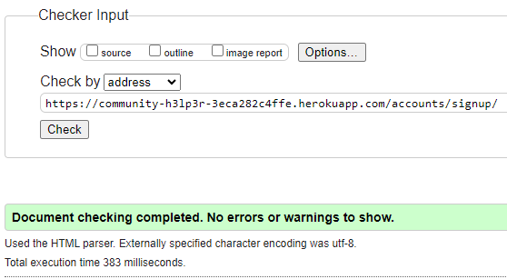
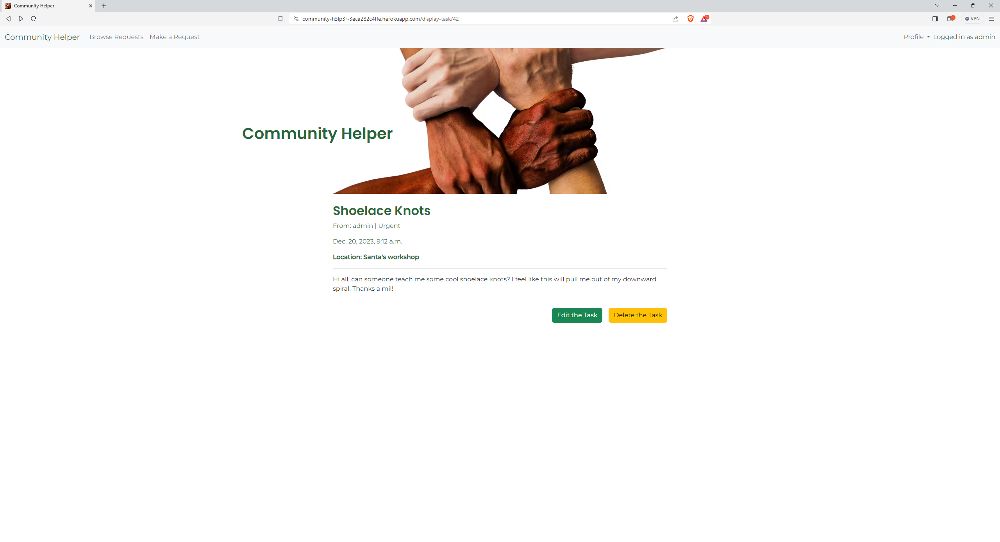
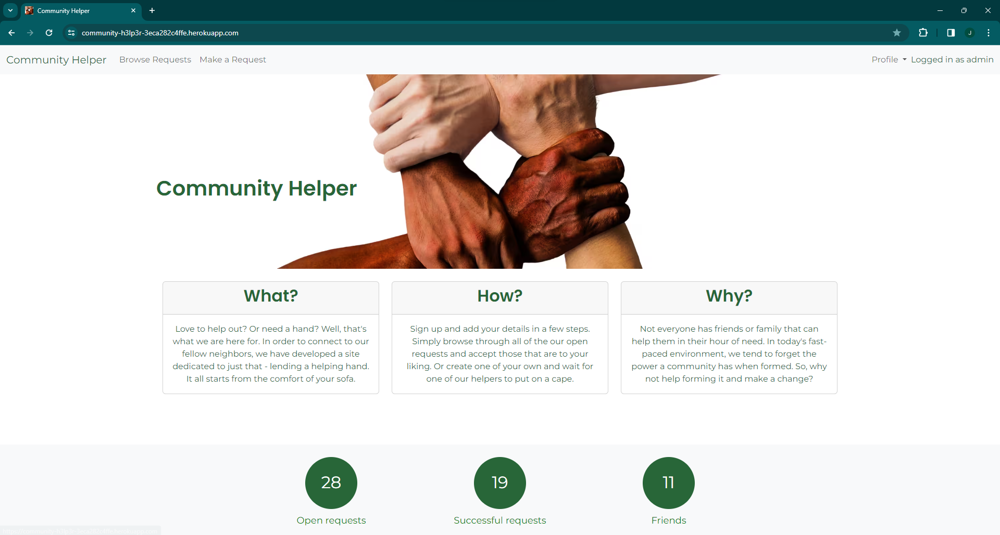
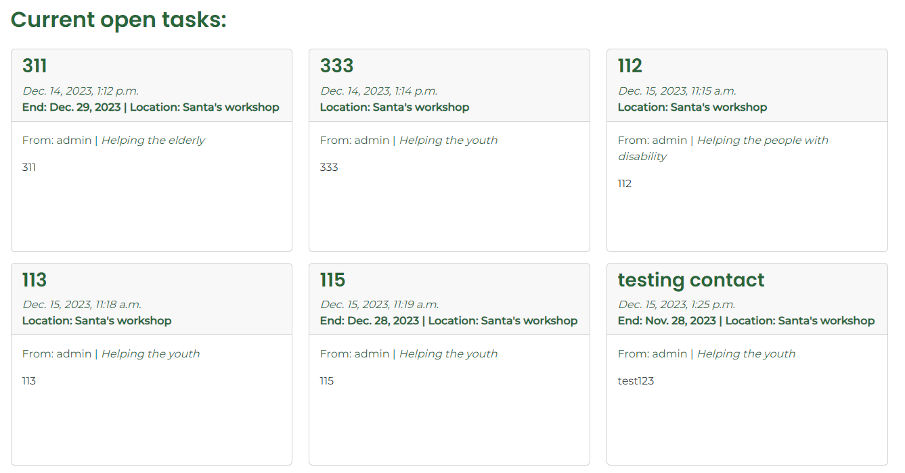

# Testing

Return back to the [README.md](README.md) file.

## Code Validation

### HTML

I have used the recommended [HTML W3C Validator](https://validator.w3.org) to validate all of my HTML files.


| Page | W3C URL | Screenshot | Notes |
| --- | --- | --- | --- |
| Home | [W3C](https://validator.w3.org/nu/?doc=https%3A%2F%2Fcommunity-h3lp3r-3eca282c4ffe.herokuapp.com%2F) |  | Pass: No Errors |
| Login | [W3C](https://validator.w3.org/nu/?doc=https%3A%2F%2Fcommunity-h3lp3r-3eca282c4ffe.herokuapp.com%2Faccounts%2Flogin%2F) |  | Pass: No Errors |
| Signup | [W3C](https://validator.w3.org/nu/?doc=https%3A%2F%2Fcommunity-h3lp3r-3eca282c4ffe.herokuapp.com%2Faccounts%2Fsignup%2F) |  | Pass: No Errors |
| Open Tasks | [W3C](https://validator.w3.org/nu/?doc=https%3A%2F%2Fcommunity-h3lp3r-3eca282c4ffe.herokuapp.com%2Fopen-tasks%2F) |  | Pass: No Errors |

Below pages were validated through a manual input as they required user to be logged in. Code was obtained by selecting **View Page Source** (usually `CTRL+U` or `⌘+U` on Mac).

As such, W3C links are purely informational.

| Page | W3C URL | Screenshot | Notes |
| --- | --- | --- | --- |
| Logout | [W3C](https://validator.w3.org/nu/?doc=https%3A%2F%2Fcommunity-h3lp3r-3eca282c4ffe.herokuapp.com%2Faccounts%2Flogout%2F) |  | Pass: No Errors |
| Display Task | [W3C](https://validator.w3.org/nu/?doc=https%3A%2F%2Fcommunity-h3lp3r-3eca282c4ffe.herokuapp.com%2Fdisplay-task%2F42) |  | Input cannot be a child of anchor, fixed |
| Edit Task | [W3C](https://validator.w3.org/nu/?doc=https%3A%2F%2Fcommunity-h3lp3r-3eca282c4ffe.herokuapp.com%2Fedit-task%2F42) |  | Section lacks heading, fixed |
| Delete Task | [W3C](https://validator.w3.org/nu/?doc=https%3A%2F%2Fcommunity-h3lp3r-3eca282c4ffe.herokuapp.com%2Fdelete-task%2F42) |  | Pass: No Errors |
| Profile | [W3C](https://validator.w3.org/nu/?doc=https%3A%2F%2Fcommunity-h3lp3r-3eca282c4ffe.herokuapp.com%2Fprofile%2F) |  | Pass: No Errors |
| Own Task list | [W3C](https://validator.w3.org/nu/?doc=https%3A%2F%2Fcommunity-h3lp3r-3eca282c4ffe.herokuapp.com%2Ftask-list%2F) |  | Pass: No Errors |
| New Task | [W3C](https://validator.w3.org/nu/?doc=https%3A%2F%2Fcommunity-h3lp3r-3eca282c4ffe.herokuapp.com%2Fsubmission%2F) |  | Nested form, fixed |
| Ongoing Task | [W3C](https://validator.w3.org/nu/?doc=https%3A%2F%2Fcommunity-h3lp3r-3eca282c4ffe.herokuapp.com%2Fongoing-task%2F74) |  | Pass: No Errors |
| Filter | [W3C](https://validator.w3.org/nu/?showsource=yes&doc=https%3A%2F%2Fcommunity-h3lp3r-3eca282c4ffe.herokuapp.com%2Ffilter%2F) |  | Pass: No Errors |

### CSS

I have used the recommended [CSS Jigsaw Validator](https://jigsaw.w3.org/css-validator) to validate all of my CSS files.

All errors are coming from Bootstrap:

| File | Jigsaw URL | Screenshot | Notes |
| --- | --- | --- | --- |
| style.css | [Jigsaw](https://jigsaw.w3.org/css-validator/validator?uri=https%3A%2F%2Fcommunity-h3lp3r-3eca282c4ffe.herokuapp.com%2F&profile=css3svg&usermedium=all&warning=1&vextwarning=&lang=en) |  | 1 is not a aspect-ratio value : 1, fixed |


### JavaScript

I have used the recommended [JShint Validator](https://jshint.com) to validate JS used within `script` elements of HTML documents.

| File | Screenshot | Notes |
| --- | --- | --- |
| edit_task.html |  | Pass: No Errors |
| create_task.html |  | Pass: No Errors |

### Python

I have used the recommended [PEP8 CI Python Linter](https://pep8ci.herokuapp.com) to validate all of my Python files.

| File | CI URL | Screenshot | Notes |
| --- | --- | --- | --- |
| Board admin.py | [PEP8 CI](https://pep8ci.herokuapp.com/https://raw.githubusercontent.com/josipcodes/community-helper/main/board/admin.py) |  | Pass: No Errors |
| Board forms.py | [PEP8 CI](https://pep8ci.herokuapp.com/https://raw.githubusercontent.com/josipcodes/community-helper/main/board/forms.py) |  | Pass: No Errors |
| Board models.py | [PEP8 CI](https://pep8ci.herokuapp.com/https://raw.githubusercontent.com/josipcodes/community-helper/main/board/models.py) |  | Pass: No Errors |
| Board urls.py | [PEP8 CI](https://pep8ci.herokuapp.com/https://raw.githubusercontent.com/josipcodes/community-helper/main/board/urls.py) |  | Pass: No Errors |
| Board views.py | [PEP8 CI](https://pep8ci.herokuapp.com/https://raw.githubusercontent.com/josipcodes/community-helper/main/board/views.py) |  | Pass: No Errors |
| Community Helper settings.py | [PEP8 CI](https://pep8ci.herokuapp.com/https://raw.githubusercontent.com/josipcodes/community-helper/main/communityhelper/settings.py) |  | Pass: No Errors |
| Community Helper urls.py | [PEP8 CI](https://pep8ci.herokuapp.com/https://raw.githubusercontent.com/josipcodes/community-helper/main/communityhelper/urls.py) |  | Pass: No Errors |

## Browser Compatibility

I've tested my deployed project on multiple browsers to check for compatibility issues.

Browsers used:
- [Chrome](https://www.google.com/chrome)
- [Firefox (Developer Edition)](https://www.mozilla.org/firefox/developer)
- [Brave](https://brave.com/download)

| Browser | Home | Task List | New Task | Profile | Own Tasks | Edit Task | Show Task | Ongoing Task | Login | 404 |
| --- | --- | --- | --- | --- | --- | --- | --- | --- | --- | --- |
| Chrome |  |  |  |  |  |  |  |  |  |  | Works as expected |
| Firefox |  |  |  |  |  |  |  |  |  |  | Works as expected |
| Brave |  |  |  |  |  |  |  |  |  |  | Works as expected |


## Responsiveness

I've tested my deployed project on multiple devices to check for responsiveness issues.

| Device | Home | New Task | Own Tasks | Show Task | Notes |
| --- | --- | --- | --- | --- | --- |
| Mobile (DevTools) |  |  |  |  | Works as expected |
| Tablet (DevTools) |  |  |  |  | Works as expected |
| Desktop |  |  |  |  | Works as expected |


## Lighthouse Audit

I've tested my deployed project using the Lighthouse Audit tool to check for any major issues.

| Page | Mobile | Desktop | Notes |
| --- | --- | --- | --- |
| Homepage |  |  | Render-blocking resources, image sizing, unused CSS, JS |
| Signup |  |  | Render-blocking resources, image sizing, unused CSS, JS |
| Login |  |  | Render-blocking resources, image sizing, unused CSS, JS |
| Logout |  |  | Render-blocking resources, image sizing, unused CSS, JS |
| Browse Tasks |  |  | Render-blocking resources, image sizing, unused CSS, JS |
| Create a Task |  |  | Render-blocking resources, image sizing, unused CSS, JS |
| Profile |  |  | Render-blocking resources, image sizing, unused CSS, JS |
| Own Tasks |  |  | Render-blocking resources, image sizing, unused CSS, JS |
| Show Task |  |  | Render-blocking resources, image sizing, unused CSS, JS |
| Ongoing task |  |  | Render-blocking resources, image sizing, unused CSS, JS |
| Edit Task |  |  | Render-blocking resources, image sizing, unused CSS, JS |
| Delete Task |  |  | Render-blocking resources, image sizing, unused CSS, JS |

To note, during Lighthouse Audit, Lighthouse was providing bingo-like numbers with their values changing significantly between each audit of the same page.

## Defensive Programming

Defensive programming was manually tested with the below user acceptance testing:

| Page | User Action | Expected Result | Pass/Fail | Screenshot | Comments |
| --- | --- | --- | --- | --- | --- |
| Home | | | | | |
| | Click on Logo | Redirection to Home page | Pass |  | |
| | Click on Register | Redirection to signup page | Pass |  | |
| | Click on Login | Redirection to login page | Pass |  | |
| | Click on Browse Requests | Redirection to task list | Pass |  | |
| | Create a task | Updates Open requests in footer, adds a success message below the header image | Pass |  | |
| | Archive Task | Updates Successful requests in footer | Pass |  | |
| | Create a User | Updates Friends in footer | Pass |  | |
| | Delete a Task | Updates Open requests in footer, adds a success message below the header image | Pass |  | |
| | Delete a User | Updates Open and Successful requests, Friends | Pass |  | |
| | Click on Your Profile | Redirection to the profile | Pass |  | |
| | Click on Check Requests | Redirection to own task list | Pass |  | |
| | Click on Logout | Redirection to sign-out page | Pass |  | |
| Signup | | | | | | 
| | Enter a password without a username | Prompt user to enter a username | Pass |  | |
| | Enter an existing username | Notify user that the username is taken | Pass |  | |
| | Enter an invalid username | Notify user about invalid characters | Pass |  | |
| | Enter an invalid email address | Prompt user to enter a valid email address | Pass |  | |
| | Enter an invalid password | Prompt user to enter a valid password | Pass |  | |
| | Create an account with/out email address | Create account, redirection to homepage, success message displayed below the header image | Pass |  | |
| | Click on Sign-in | Redirection to login page | Pass |  | |
|Sign In | | | | | | 
| | Input password without a username | Prompt user to enter a username | Pass |  | |
| | Input a username and invalid password | Notify user that the details aren't correct | Pass |  | |
| | Input correct login details | Log user in, redirection to homepage, display success message below the header image | Pass |  | |
| | Click on Sign up | Redirection to signup page | Pass |  | |
| Sign Out | | | | | | 
| | Click on Sign Out button | User is signed out, redirection to the homepage, success message is displayed below header image | Pass |  | |
| Browse Requests | | | | | | 
| | Click on a task | Redirection to the task display | Pass |  | |
| | Click on the Filter button | Redirection to task filtering | Pass |  | |
| | Click on a different page number | Redirection to another page of task list | Pass |  | |
| | Click on a task when logged out | Redirection to login | Pass |  | |
| | Task in the list has a deadline | Deadline is displayed | Pass |  | |
| | Task in the list doesn't have a deadline | Deadline isn't displayed | Pass |  | |
| Profile | | | | | | 
| | When user has no profile, submit empty form | Prompt user to input value into the first empty field | Pass |  | |
| | When user has no profile, submit form with any fields being empty | Prompt user to input value into the first empty field | Pass |  | |
| | Add value to each field and submit form | Reloads the page, adds success message below the header image | Pass |  | We have not enforced minimum character value, nor rules regarding certain fields not being allowed to have numberical values entered as some users might not want to add their private details |
| | When user has an existing profile, update fields to not contain value |  Prompt user to input value into the first empty field | Pass |  | |
| | Update all values | Reloads the page, adds success message below the header image | Pass |  | |
| | When logged out, add /profile to the url to attempt brute-force entry | Redirection to login page | Pass |  | |
| Filter Task | | | | | | 
| | Click filter without choosing a category | Displays a warning message | Pass |  | |
| | Click filter after choosing a valid category | Renders available tasks in the filtered category | Pass |  | |
| | Click filter after choosing a category without any tasks | Renders a notification stating there are no tasks in a chosen category | Pass |  | |
| | Click on a filtered task | Redirection to the task display | Pass |  | |
| | Filter categories for one with more than 3 tasks | Displays a 'Back to Top' button | Pass |  | Use screen equal to or less than 767px wide |
| | Filter categories for one with equal to or less than 3 tasks | Doesn't display a 'Back to Top' button | Pass |  | Use screen equal to or less than 767px wide |
| | Click 'Back To Top' button | Takes user to the top of the page | Pass |  | Use screen equal to or less than 767px wide |
| | When logged out, manually input url leading to a filter to attempt brute-force entry | Redirection to login page | Pass |  | |
| Own Tasks | | | | | | 
| | Click on a task you've created | Redirection to the task page | Pass |  | If the task has a helper, it is considered ongoing task, otherwise we're rendering display-task page |
| | Click on a task you're helping on | Redirection to ongoing task page | Pass |  | |
| | Use screen equal to or less than 767px wide when you have some tasks you are working on | Display 'Back To Top' button | Pass |  | |
| | Use screen wider than 767px when you have some tasks you are working on | Doesn't display 'Back To Top' button | Pass |  | |
| | Click 'Back To Top' button | Takes user to the top of the page | Pass |  | Use screen equal to or less than 767px wide |
| | When you're not working on any tasks, click on 'Check Requests' | Displays notes stating there are no tasks in the list | Pass |  | |
| | When you're not working on any tasks, and in own task-list, click on "we're here for you" | Redirection to submission | Pass |  | |
| | When you're not working on any tasks, and in own task-list, click on "here you go" | Redirection to general task list | Pass |  | |
| | When not logged in, input a url taking you to the own task list | Redirection to login | Pass |  | |
| Task Display | | | | | | 
| | Click on a task in 'Browse Requests' which you are not an owner of | Displays task with 'Accept a Task' button | Pass |  | |
| | Click on a task in 'Browse Requests' which you are an owner of | Displays task with 'Edit' and 'Delete' buttons | Pass |  | |
| | Click on a task in 'Browse Requests' which you are not an owner of, then click 'Accept' button | Redirection to homepage, success message displayed below the header image | Pass |  | Secondary verification is available in the own task list where user can see they are now a helper on said task |
| | Click on a task in 'Browse Requests' which you are an owner of, then click 'Edit' button | Redirection to edit-task page | Pass |  | |
| | Click on a task in 'Browse Requests' which you are an owner of, then click 'Delete' button | Redirection to delete-task page | Pass |  | |
| | When logged out, manually input url leading to a display-task to attempt brute-force entry | Redirection to sign-in page | Pass |  | |
| Create Task | | | | | | 
| | With a new account, leave each field blank and click submit | Prompts user to enter information into required fields (all except Deadline) | Pass |  | |
| | Click submit after entering valid info | Redirection to own tasks with task being visible there, success message displays below header image | Pass |  | |
| | With existing profile, add task information and change profile information before clicking Submit | Creates task, updates profile, success message displays below header image | Pass |  |Profile update is visible by Location in the task, or in the Profile |
| | Input valid data when creating a task, but set date to a past date manually | Prompts user to enter a valid date | Pass |  | |
| | Manually enter an url taking you to the submission page | Redirection to login | Pass |  | |
| Edit Task | | | | | | 
| | Leave Title, Description or Category empty and click Update button | Prompt user to input value | Pass |  | |
| | Set a deadline to a past date manually and click Update button | Prompt user to input a current or future date | Pass |  | |
| | Input new valid data into all fields and click Update button | Edits the task, displays success message below the header image, redirection to task display with new data visible. Date and time of update displays within the task. | Pass |  | |
| | Clear deadline date and click Update button | Edits the task, displays success message below the header image, redirection to task display with new data visible. Date and time of update displays within the task. | Pass |  | |
| | Manually input url leading to a task-editing page for a task you're a helper on, to attempt brute-force entry | Redirection to own task list, warning message displays below the header image | Pass |  | |
| | Manually input url leading to a task-editing page for a task which is not yours nor has a helper assigned, to attempt brute-force entry | Redirection to own task list, warning message displays below the header image | Pass |  | |
| | When logged out, manually input url leading to a task-editing page to attempt brute-force entry | Redirection to sign-in page | Pass |  | |
| Delete Task | | | | | | 
| | Click on 'I am sure, delete it' button | Redirection to the own task list, success message displays below the header image, task is no longer available in the own task section | Pass |  | |
| | Manually input url leading to a task-deletion page for a task you're a helper on, to attempt brute-force entry | Redirection to own task list, warning message displays below the header image | Pass |  | |
| | Manually input url leading to a task-deletion page for a task which is not yours nor has a helper assigned, to attempt brute-force entry | Redirection to own task list, warning message displays below the header image | Pass |  | |
| | Manually input url leading to a task-deletion page for a task which you've previously archived, to attempt brute-force entry | Redirection to own task list, warning message displays below the header image | Pass |  | |
| | When logged out, manually input url leading to a task-deletion page to attempt brute-force entry | Redirection to sign-in page | Pass |  | |
| Archive Task | | | | | | 
| | Click on a 'Mark task as finished' button of which you're the owner and has assigned helper | Redirection to own task list, displays success message below the header image | Pass |  | |
| | Click on a 'Go back' button | Redirection to the ongoing task | Pass |  | |
| | Manually input url leading to a task-archiving page for an already archived task you own | Redirection to own task list, warning message displays below the header image | Fail |  | added a task.status condition in archive_task view, passed after the fix |
| | Manually input url leading to a task-archiving page for a task you own but has no helper | Redirection to own task list, warning message displays below the header image | Fail |  | added a task.status condition in archive_task view, passed after the fix |
| | Manually input url leading to a task-archiving page you are a helper on, to attempt brute-force entry | Redirection to own task list, warning message displays below the header image | Pass |  | |
| | Manually input url leading to a task-archiving page you are not associated with, to attempt brute-force entry | Redirection to own task list, warning message displays below the header image | Pass |  | |
| | When logged out, manually input url leading to a task-archiving page to attempt brute-force entry | Redirection to sign-in page | Pass |  | |
| Ongoing Task | | | | | | 
| | Input a comment and click Comment | Reloads the page, displays a comment below the Comment button, displays a success message below the header image. | Pass |  | |
| | Open a task which you are an owner of and has a helper | 'Mark Task as Done' button is displayed | Pass |  | |
| | Open a task which you are an owner of and has a helper, click 'Mark Task as Done' | Redirection to archive task page | Pass |  | |
| | Open a task which you are an owner of or a helper on, and task has both | Owner's location is displayed | Pass |  | |
| | Open a task which you are a helper on, and task has both | 'Mark Task as Done' button is not displayed | Pass |  | |
| | Manually input a url taking you to an ongoing task that you are not participating on | Redirection to own task list with warning message displayed below the header image | Pass |  | |
| | Manually input a url taking you to an ongoing task when logged out | Redirection to login | Pass |  | |
| | Manually input a url taking you to an ongoing task which you previously marked as archived | Redirection to own task list, warning message displayed below the header image | Pass |  | |
| | Open a task from 'Browse Requests' and replace 'display' in url with 'ongoing' | Redirection to own task list, warning message displayed below the header image | Pass |  | |

## User Story Testing

### New Site Users

| User Story | Screenshot |
| --- | --- |
| As a user, I can read about the website goal so that I can decide if I want to sign up. |  |
| As a potential user, I can view how many users/requests the website has so that I know if it's a real deal before signing up. |  |
| As a user, I can register so that I can accept or post tasks/requests. |  |
| As a user, I can categorize my request so that I can receive help quicker. |  |
| As a user, I can choose a deadline of my request so that I don't receive help when not needed. |  |
| As a user, I can only choose future date for a deadline so that I don't accidentally choose a past date. |  |
| As a user, I can submit a request so that I can receive help from the community. |  |
| As a user, I can browse through requests so that I find a suitable one. |  |
| As a user, I can navigate through pages of requests so that I can find a suitable one in order to accept it. |  |
| As a user, I can see the correct date of task creation/editing so that I know when the last change was made. |  |
| As a user, I can accept someone's request so that I can help the community. |  |

### Mobile Users

| User Story | Screenshot |
| --- | --- |
| As a mobile user, I can click a 'go back up' button so that I can return to the top of the page instantly and not have to scroll. |  |
| As a user using a smaller desktop screen, I can clearly see the mission statement so that I know what the page is about. |  |

### Returning Site Users

| User Story | Screenshot |
| --- | --- |
| As a user, I can instantly recognise the Community Helper tab by it's favicon so that I avoid unnecessary clicks. |  |
| As a user, I can login so that I can check on the progress of my task/request or accept a task/request. |  |
| As a user, I can log out from the site so that I don't jeopardize my or someone else's information. |  |
| As a user, I can ensure my own privacy with login being required for any sensitive areas of the website so that I can be at ease with my information and information of others. |  |
| As a user, I can filter through requests so that I save time while looking for a suitable one. |  |
| As a user, I can see the location of the owner so that I can decide if I want to open the task to read more about it and accept it. |  |
| As a user, I can open an active request so that I can view it in full and decide if I want to accept it. |  |
| As a user, I can see the same information when filtering as I would in a general task list so that I don't have to unnecessarily open all tasks to find out if they have an end date and their location. |  |
| As a user, I can clearly see when I'm logged in so that I know to logout when necessary. |  |
| As a user, I can navigate to a page with my active requests so that I can update them or be reminded of what needs doing. |  |
| As a user who submitted the request, I can mark it as done so that I can keep better track of my requests. |  |
| As a submitter/helper, I can comment on the request so that I can request an update/info. |  |
| As a user, I can see that the comment form is visually similar to the task form so that I don't break the illusion of the brand. |  |
| As a user who published a task, I can edit it so that I provide up to date information to a future helper. |  |
| As a user who published a task, I can delete it so that I don't clog request list with something that is outdated/unneccessary. |  |
| As a user, I can confirm that I want to delete my request so that I don't do it on accident. |  |
| As a user, I can confirm that I want to mark a task as closed so that I don't do it accidentally. |  |
| As a user, I can enter relevant information in my profile so that I don't have to repeat myself later on. |  |
| As a user, I can see a notification that I've opened a page that doesn't exist so that I can navigate to where I actually wanted to go. |  |

### Site Admin

| User Story | Screenshot |
| --- | --- |
| As an administrator, I can access admin panel so that I can monitor my page and edit necessary items. |  |

## Bugs

- Contents of a comment remain in the form after it has been published.

[Documented bug](https://github.com/josipcodes/community-helper/issues/43)
    
    - To fix this, I have added an empty `form` into the `context`, however, this fix was refactored later on.

- `Pagination` is displayed over content.

[Documented bug](https://github.com/josipcodes/community-helper/issues/37)

    - To fix this, I have removed `fixed-bottom class` from the pagination `div`.

- `Footer` covers content on <=575px width.

[Documented bug](https://github.com/josipcodes/community-helper/issues/33)

    - To fix this, I have added `footer margin` using `CSS`.

- Styling changes when user is logged in or logged out.

[Documented bug](https://github.com/josipcodes/community-helper/issues/29)

    - To fix this, I have created a class `task-link` and associted it with existing CSS rule regarding link display.

- Navbar links change position when user is logged in or logged out.

[Documented bug](https://github.com/josipcodes/community-helper/issues/28)

    - To fix this, I have removed `me-auto class` from the affected `ul`.

- Overflow x when user opens the dropdown menu.

[Documented bug](https://github.com/josipcodes/community-helper/issues/22)
[Related user story](https://github.com/josipcodes/community-helper/issues/21)

    - To present a true Agile approach, this bug was prioritised due to existence of a user story which presented a type of fix. As such, we have included a template which confirms user's username when logged in, depending on their screen size.

```
    

    <span class="brand-color">
        Logged in as {{ user.username }}
    </span>
```

### GitHub **Issues**

**Fixed Bugs**

All previously closed/fixed bugs can be tracked [here](https://github.com/josipcodes/community-helper/issues?q=label%3Abug+is%3Aclosed).

## Unfixed Bugs

There are no remaining bugs that I am aware of.