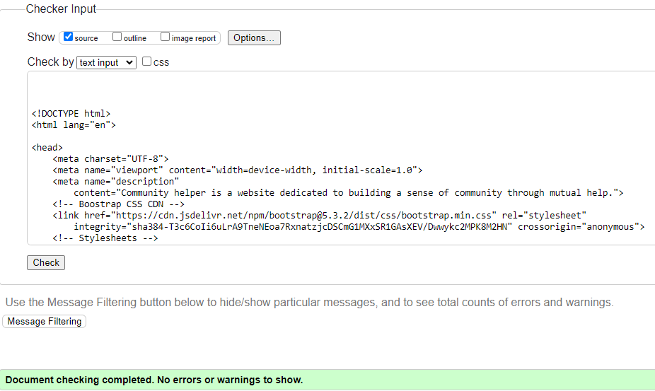
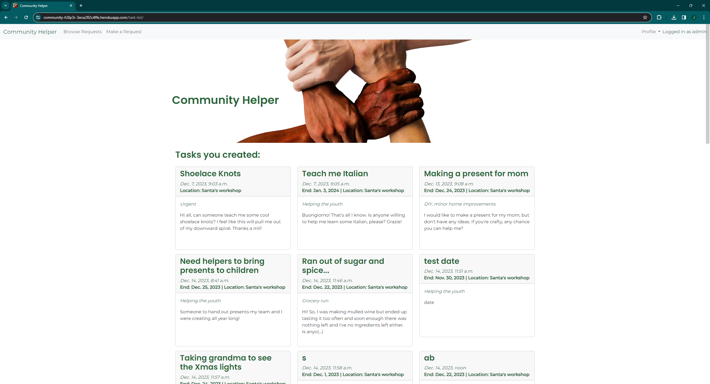

# Testing

Return back to the [README.md](README.md) file.

## Code Validation

### HTML

I have used the recommended [HTML W3C Validator](https://validator.w3.org) to validate all of my HTML files.

| Page | W3C URL | Screenshot | Notes |
| --- | --- | --- | --- |
| Home | [W3C](https://validator.w3.org/nu/?doc=https%3A%2F%2Fcommunity-h3lp3r-3eca282c4ffe.herokuapp.com%2F) |  | Pass: No Errors |
| Login | [W3C](https://validator.w3.org/nu/?doc=https%3A%2F%2Fcommunity-h3lp3r-3eca282c4ffe.herokuapp.com%2Faccounts%2Flogin%2F) |  | Pass: No Errors |
| Signup | [W3C](https://validator.w3.org/nu/?doc=https%3A%2F%2Fcommunity-h3lp3r-3eca282c4ffe.herokuapp.com%2Faccounts%2Fsignup%2F) |  | Pass: No Errors |
| Open Tasks | [W3C](https://validator.w3.org/nu/?doc=https%3A%2F%2Fcommunity-h3lp3r-3eca282c4ffe.herokuapp.com%2Fopen-tasks%2F) |  | Pass: No Errors |

Below pages were validated through a manual input as they required user to be logged in. Code was obtained by selecting **View Page Source** (usually `CTRL+U` or `⌘+U` on Mac).

As such, W3C links are purely informational.

| Page | W3C URL | Screenshot | Notes |
| --- | --- | --- | --- |
| Logout | [W3C](https://validator.w3.org/nu/?doc=https%3A%2F%2Fcommunity-h3lp3r-3eca282c4ffe.herokuapp.com%2Faccounts%2Flogout%2F) |  | Pass: No Errors |
| Display Task | [W3C](https://validator.w3.org/nu/?doc=https%3A%2F%2Fcommunity-h3lp3r-3eca282c4ffe.herokuapp.com%2Fdisplay-task%2F42) |  | Input cannot be a child of anchor, fixed |
| Edit Task | [W3C](https://validator.w3.org/nu/?doc=https%3A%2F%2Fcommunity-h3lp3r-3eca282c4ffe.herokuapp.com%2Fedit-task%2F42) |  | Section lacks heading, fixed |
| Delete Task | [W3C](https://validator.w3.org/nu/?doc=https%3A%2F%2Fcommunity-h3lp3r-3eca282c4ffe.herokuapp.com%2Fdelete-task%2F42) |  | Pass: No Errors |
| Profile | [W3C](https://validator.w3.org/nu/?doc=https%3A%2F%2Fcommunity-h3lp3r-3eca282c4ffe.herokuapp.com%2Fprofile%2F) |  | Pass: No Errors |
| Own Task list | [W3C](https://validator.w3.org/nu/?doc=https%3A%2F%2Fcommunity-h3lp3r-3eca282c4ffe.herokuapp.com%2Ftask-list%2F) |  | Pass: No Errors |
| New Task | [W3C](https://validator.w3.org/nu/?doc=https%3A%2F%2Fcommunity-h3lp3r-3eca282c4ffe.herokuapp.com%2Fsubmission%2F) |  | Nested form, fixed |
| Ongoing Task | [W3C](https://validator.w3.org/nu/?doc=https%3A%2F%2Fcommunity-h3lp3r-3eca282c4ffe.herokuapp.com%2Fongoing-task%2F74) |  | Pass: No Errors |
| Filter | [W3C](https://validator.w3.org/nu/?showsource=yes&doc=https%3A%2F%2Fcommunity-h3lp3r-3eca282c4ffe.herokuapp.com%2Ffilter%2F) |  | Pass: No Errors |

### CSS

I have used the recommended [CSS Jigsaw Validator](https://jigsaw.w3.org/css-validator) to validate all of my CSS files.

All errors are coming from Bootstrap:

| File | Jigsaw URL | Screenshot | Notes |
| --- | --- | --- | --- |
| style.css | [Jigsaw](https://jigsaw.w3.org/css-validator/validator?uri=https%3A%2F%2Fcommunity-h3lp3r-3eca282c4ffe.herokuapp.com%2F&profile=css3svg&usermedium=all&warning=1&vextwarning=&lang=en) |  | 1 is not a aspect-ratio value : 1, fixed |

### JavaScript

I have used the recommended [JShint Validator](https://jshint.com) to validate JS used within `script` elements of HTML documents.

| File | Screenshot | Notes |
| --- | --- | --- |
| edit_task.html |  | Pass: No Errors |
| create_task.html |  | Pass: No Errors |

### Python

I have used the recommended [PEP8 CI Python Linter](https://pep8ci.herokuapp.com) to validate all of my Python files.

| File | CI URL | Screenshot | Notes |
| --- | --- | --- | --- |
| Board admin.py | [PEP8 CI](https://pep8ci.herokuapp.com/https://raw.githubusercontent.com/josipcodes/community-helper/main/board/admin.py) |  | Pass: No Errors |
| Board forms.py | [PEP8 CI](https://pep8ci.herokuapp.com/https://raw.githubusercontent.com/josipcodes/community-helper/main/board/forms.py) |  | Pass: No Errors |
| Board models.py | [PEP8 CI](https://pep8ci.herokuapp.com/https://raw.githubusercontent.com/josipcodes/community-helper/main/board/models.py) |  | Pass: No Errors |
| Board urls.py | [PEP8 CI](https://pep8ci.herokuapp.com/https://raw.githubusercontent.com/josipcodes/community-helper/main/board/urls.py) |  | Pass: No Errors |
| Board views.py | [PEP8 CI](https://pep8ci.herokuapp.com/https://raw.githubusercontent.com/josipcodes/community-helper/main/board/views.py) |  | Pass: No Errors |
| Community Helper settings.py | [PEP8 CI](https://pep8ci.herokuapp.com/https://raw.githubusercontent.com/josipcodes/community-helper/main/communityhelper/settings.py) |  | Pass: No Errors |
| Community Helper urls.py | [PEP8 CI](https://pep8ci.herokuapp.com/https://raw.githubusercontent.com/josipcodes/community-helper/main/communityhelper/urls.py) |  | Pass: No Errors |

## Browser Compatibility

I've tested my deployed project on multiple browsers to check for compatibility issues.

Browsers used:
- [Chrome](https://www.google.com/chrome)
- [Firefox (Developer Edition)](https://www.mozilla.org/firefox/developer)
- [Brave](https://brave.com/download)

| Browser | Home | Task List | New Task | Profile | Own Tasks | Edit Task | Show Task | Ongoing Task | Login | 404 |
| --- | --- | --- | --- | --- | --- | --- | --- | --- | --- | --- |
| Chrome |  |  |  |  |  |  |  |  |  |  | Works as expected |
| Firefox |  |  |  |  |  |  |  |  |  |  | Works as expected |
| Brave |  |  |  |  |  |  |  |  |  |  | Works as expected |

## Responsiveness

I've tested my deployed project on multiple devices to check for responsiveness issues.

| Device | Home | New Task | Own Tasks | Show Task | Notes |
| --- | --- | --- | --- | --- | --- |
| Mobile (DevTools) |  |  |  |  | Works as expected |
| Tablet (DevTools) |  |  |  |  | Works as expected |
| Desktop |  |  |  |  | Works as expected |

## Lighthouse Audit

I've tested my deployed project using the Lighthouse Audit tool to check for any major issues.

| Page | Mobile | Desktop | Notes |
| --- | --- | --- | --- |
| Homepage |  |  | Render-blocking resources, image sizing, unused CSS, JS |
| Signup |  |  | Render-blocking resources, image sizing, unused CSS, JS |
| Login |  |  | Render-blocking resources, image sizing, unused CSS, JS |
| Logout |  |  | Render-blocking resources, image sizing, unused CSS, JS |
| Browse Tasks |  |  | Render-blocking resources, image sizing, unused CSS, JS |
| Create a Task |  |  | Render-blocking resources, image sizing, unused CSS, JS |
| Profile |  |  | Render-blocking resources, image sizing, unused CSS, JS |
| Own Tasks |  |  | Render-blocking resources, image sizing, unused CSS, JS |
| Show Task |  |  | Render-blocking resources, image sizing, unused CSS, JS |
| Ongoing task |  |  | Render-blocking resources, image sizing, unused CSS, JS |
| Edit Task |  |  | Render-blocking resources, image sizing, unused CSS, JS |
| Delete Task |  |  | Render-blocking resources, image sizing, unused CSS, JS |

To note, during Lighthouse Audit, Lighthouse was providing bingo-like numbers with their values changing significantly between each audit of the same page.

## Defensive Programming

🛑🛑🛑🛑🛑 START OF NOTES (to be deleted) 🛑🛑🛑🛑🛑

Expected Outcome / Test Performed / Result Received / Fixes Implemented

- **Expected**: "Feature is expected to do X when the user does Y."
- **Testing**: "Tested the feature by doing Y."
- (either) **Result**: "The feature behaved as expected, and it did Y."
- (or) **Result**: "The feature did not respond to A, B, or C."
- **Fix**: "I did Z to the code because something was missing."

🛑🛑🛑🛑🛑 END OF NOTES (to be deleted) 🛑🛑🛑🛑🛑

Defensive programming was manually tested with the below user acceptance testing:

| Page | User Action | Expected Result | Pass/Fail | Screenshot | Comments |
| --- | --- | --- | --- | --- | --- |
| Home | | | | | |
| | Click on Logo | Redirection to Home page | Pass |  | |
| | Click on Register | Redirection to signup page | Pass |  | |
| | Click on Login | Redirection to signup page | Pass |  | |
| | Click on Browse Requests | Redirection to task list | Pass |  | |
| | Create a task | Updates Open requests in footer, adds a success message below the header image | Pass |  | |
| | Archive Task | Updates Successful requests in footer | Pass |  | |
| | Create a User | Updates Friends in footer | Pass |  | |
| | Delete a Task | Updates Open requests in footer, adds a success message below the header image | Pass |  | |
| | Delete a User | Updates Open and Successful requests, Friends | Pass |  | |
| | Click on Your Profile | Redirection to the profile | Pass |  | |
| | Click on Check Requests | Redirection to own task list | Pass |  | |
| | Click on Logout | Redirection to sign-out page | Pass |  | |
| | Add /profile to the url to attempt brute-force entry | Redirection to sign-in page | Pass |  | |
| Signup | | | | | | 
| | Enter a password without a username | Prompt user to enter a username | Pass |  | |
| | Enter an existing username | Notify user that the username is taken | Pass |  | |
| | Enter an invalid username | Notify user about invalid characters | Pass |  | |
| | Enter an invalid email address | Prompt user to enter a valid email address | Pass |  | |
| | Enter an invalid password | Prompt user to enter a valid password | Pass |  | |
| | Create an account without email address | Create account, redirection to homepage | Pass |  | |
| | Click on Sign-in | Redirection to login page | Pass |  | |
|Sign In | | | | | | 
| | Input password without a username | Prompt user to enter a username | Pass |  | |
| | Input a username and invalid password | Notify user that the details aren't correct | Pass |  | |
| | Input correct login details | Log user in, redirection to homepage, display success message below the header image | Pass |  | |
| | Click on Sign up | Redirection to signup page | Pass |  | |
| Sign Out | | | | | | 
| | Click on Sign Out button | User is signed out, redirection to the homepage, success message is displayed below header image | Pass |  | |
| Browse Requests | | | | | | 
| | Click on a task | Redirection to a task display | Pass |  | |
| | Click on the Filter button | Redirection to task filtering | Pass |  | |
| | Click on a different page number | Redirection to another page of task list | Pass |  | |
| | Click on a task when logged out | Redirection to login | Pass |  | |
| Profile | | | | | | 
| | When user has no profile, submit empty form | Prompt user to input value into the first empty field | Pass |  | |
| | When user has no profile, submit form with any fields being empty | Prompt user to input value into the first empty field | Pass |  | |
| | Add value to each field and submit forrm | Reloads the page, adds success message below the header image | Pass |  | We have not enforced minimum character value, nor rules regarding certain fields not being allowed to have numberical values entered as some users might not want to add their private details |
| | When user has an existing profile, update fields to not contain value |  Prompt user to input value into the first empty field | Pass |  | |
| | Update all values | Reloads the page, adds success message below the header image | Pass |  | |

| Create Task | | | | | | 
| | Click on a task | Redirection to a task display | Pass |  | |
| | Click on the Filter button | Redirection to task filtering | Pass |  | |
| | Click on a different page number | Redirection to another page of task list | Pass |  | |
| | Click on a task when logged out | Redirection to login | Pass |  | |
| Own Tasks | | | | | | 
| | Click on a task | Redirection to a task display | Pass |  | |
| | Click on the Filter button | Redirection to task filtering | Pass |  | |
| | Click on a different page number | Redirection to another page of task list | Pass |  | |
| | Click on a task when logged out | Redirection to login | Pass |  | |
| Task Display | | | | | | 
| | Click on a task | Redirection to a task display | Pass |  | |
| | Click on the Filter button | Redirection to task filtering | Pass |  | |
| | Click on a different page number | Redirection to another page of task list | Pass |  | |
| | Click on a task when logged out | Redirection to login | Pass |  | |
| Ongoing Task | | | | | | 
| | Click on a task | Redirection to a task display | Pass |  | |
| | Click on the Filter button | Redirection to task filtering | Pass |  | |
| | Click on a different page number | Redirection to another page of task list | Pass |  | |
| | Click on a task when logged out | Redirection to login | Pass |  | |
| Edit Task | | | | | | 
| | Click on a task | Redirection to a task display | Pass |  | |
| | Click on the Filter button | Redirection to task filtering | Pass |  | |
| | Click on a different page number | Redirection to another page of task list | Pass |  | |
| | Click on a task when logged out | Redirection to login | Pass |  | |
| Delete Task | | | | | | 
| | Click on a task | Redirection to a task display | Pass |  | |
| | Click on the Filter button | Redirection to task filtering | Pass |  | |
| | Click on a different page number | Redirection to another page of task list | Pass |  | |
| | Click on a task when logged out | Redirection to login | Pass |  | |

| Contact | | | | | |
| | Click on Contact link in navbar | Redirection to Contact page | Pass | | |
| | Enter first/last name | Field will accept freeform text | Pass | | |
| | Enter valid email address | Field will only accept email address format | Pass | | |
| | Enter message in textarea | Field will accept freeform text | Pass | | |
| | Click the Submit button | Redirects user to form-dump | Pass | User must click 'Back' button to return | |
| Sign Up | | | | |
| | Click on Sign Up button | Redirection to Sign Up page | Pass | |
| | Enter valid email address | Field will only accept email address format | Pass | |
| | Enter valid password (twice) | Field will only accept password format | Pass | |
| | Click on Sign Up button | Asks user to confirm email page | Pass | Email sent to user |
| | Confirm email | Redirects user to blank Sign In page | Pass | |
| Log In | | | | |
| | Click on the Login link | Redirection to Login page | Pass | |
| | Enter valid email address | Field will only accept email address format | Pass | |
| | Enter valid password | Field will only accept password format | Pass | |
| | Click Login button | Redirects user to home page | Pass | |
| Log Out | | | | |
| | Click Logout button | Redirects user to logout page | Pass | Confirms logout first |
| | Click Confirm Logout button | Redirects user to home page | Pass | |
| Profile | | | | |
| | Click on Profile button | User will be redirected to the Profile page | Pass | |
| | Click on the Edit button | User will be redirected to the edit profile page | Pass | |
| | Click on the My Orders link | User will be redirected to the My Orders page | Pass | |
| | Brute forcing the URL to get to another user's profile | User should be given an error | Pass | Redirects user back to own profile |
| repeat for all remaining pages | x | x | x | x |

🛑🛑🛑🛑🛑 START OF NOTES (to be deleted) 🛑🛑🛑🛑🛑

Repeat for all other tests, as applicable to your own site.
The aforementioned tests are just an example of a few different project scenarios.

🛑🛑🛑🛑🛑 END OF NOTES (to be deleted) 🛑🛑🛑🛑🛑

## User Story Testing

🛑🛑🛑🛑🛑 START OF NOTES (to be deleted) 🛑🛑🛑🛑🛑

Testing user stories is actually quite simple, once you've already got the stories defined on your README.

Most of your project's **features** should already align with the **user stories**,
so this should as simple as creating a table with the user story, matching with the re-used screenshot
from the respective feature.

🛑🛑🛑🛑🛑 END OF NOTES (to be deleted) 🛑🛑🛑🛑🛑

| User Story | Screenshot |
| --- | --- |
| As a new site user, I would like to ____________, so that I can ____________. |  |
| As a new site user, I would like to ____________, so that I can ____________. |  |
| As a new site user, I would like to ____________, so that I can ____________. |  |
| As a returning site user, I would like to ____________, so that I can ____________. |  |
| As a returning site user, I would like to ____________, so that I can ____________. |  |
| As a returning site user, I would like to ____________, so that I can ____________. |  |
| As a site administrator, I should be able to ____________, so that I can ____________. |  |
| As a site administrator, I should be able to ____________, so that I can ____________. |  |
| As a site administrator, I should be able to ____________, so that I can ____________. |  |
| repeat for all remaining user stories | x |

## Bugs

🛑🛑🛑🛑🛑 START OF NOTES (to be deleted) 🛑🛑🛑🛑🛑

This section is primarily used for JavaScript and Python applications,
but feel free to use this section to document any HTML/CSS bugs you might run into.

It's very important to document any bugs you've discovered while developing the project.
Make sure to include any necessary steps you've implemented to fix the bug(s) as well.

**PRO TIP**: screenshots of bugs are extremely helpful, and go a long way!

🛑🛑🛑🛑🛑 END OF NOTES (to be deleted) 🛑🛑🛑🛑🛑

- JS Uncaught ReferenceError: `foobar` is undefined/not defined

    

    - To fix this, I _____________________.

- JS `'let'` or `'const'` or `'template literal syntax'` or `'arrow function syntax (=>)'` is available in ES6 (use `'esversion: 11'`) or Mozilla JS extensions (use moz).

    

    - To fix this, I _____________________.

- Python `'ModuleNotFoundError'` when trying to import module from imported package

    

    - To fix this, I _____________________.

- Django `TemplateDoesNotExist` at /appname/path appname/template_name.html

    

    - To fix this, I _____________________.

- Python `E501 line too long` (93 > 79 characters)

    

    - To fix this, I _____________________.

### GitHub **Issues**

🛑🛑🛑🛑🛑 START OF NOTES (to be deleted) 🛑🛑🛑🛑🛑

An improved way to manage bugs is to use the built-in **Issues** tracker on your GitHub repository.
To access your Issues, click on the "Issues" tab at the top of your repository.
Alternatively, use this link: https://github.com/josipcodes/community-helper/issues

If using the Issues tracker for your bug management, you can simplify the documentation process.
Issues allow you to directly paste screenshots into the issue without having to first save the screenshot locally,
then uploading into your project.

You can add labels to your issues (`bug`), assign yourself as the owner, and add comments/updates as you progress with fixing the issue(s).

Once you've sorted the issue, you should then "Close" it.

When showcasing your bug tracking for assessment, you can use the following format:

🛑🛑🛑🛑🛑 END OF NOTES (to be deleted) 🛑🛑🛑🛑🛑

**Fixed Bugs**

All previously closed/fixed bugs can be tracked [here](https://github.com/josipcodes/community-helper/issues?q=is%3Aissue+is%3Aclosed).

| Bug | Status |
| --- | --- |
| [JS Uncaught ReferenceError: `foobar` is undefined/not defined](https://github.com/josipcodes/community-helper/issues/1) | Closed |
| [Python `'ModuleNotFoundError'` when trying to import module from imported package](https://github.com/josipcodes/community-helper/issues/2) | Closed |
| [Django `TemplateDoesNotExist` at /appname/path appname/template_name.html](https://github.com/josipcodes/community-helper/issues/3) | Closed |

**Open Issues**

Any remaining open issues can be tracked [here](https://github.com/josipcodes/community-helper/issues).

| Bug | Status |
| --- | --- |
| [JS `'let'` or `'const'` or `'template literal syntax'` or `'arrow function syntax (=>)'` is available in ES6 (use `'esversion: 11'`) or Mozilla JS extensions (use moz).](https://github.com/josipcodes/community-helper/issues/4) | Open |
| [Python `E501 line too long` (93 > 79 characters)](https://github.com/josipcodes/community-helper/issues/5) | Open |

## Unfixed Bugs

🛑🛑🛑🛑🛑 START OF NOTES (to be deleted) 🛑🛑🛑🛑🛑

You will need to mention unfixed bugs and why they were not fixed.
This section should include shortcomings of the frameworks or technologies used.
Although time can be a big variable to consider, paucity of time and difficulty understanding
implementation is not a valid reason to leave bugs unfixed.

If you've identified any unfixed bugs, no matter how small, be sure to list them here.
It's better to be honest and list them, because if it's not documented and an assessor finds the issue,
they need to know whether or not you're aware of them as well, and why you've not corrected/fixed them.

Some examples:

🛑🛑🛑🛑🛑 END OF NOTES (to be deleted) 🛑🛑🛑🛑🛑

- On devices smaller than 375px, the page starts to have `overflow-x` scrolling.

    

    - Attempted fix: I tried to add additional media queries to handle this, but things started becoming too small to read.

- For PP3, when using a helper `clear()` function, any text above the height of the terminal does not clear, and remains when you scroll up.

    

    - Attempted fix: I tried to adjust the terminal size, but it only resizes the actual terminal, not the allowable area for text.

- When validating HTML with a semantic `section` element, the validator warns about lacking a header `h2-h6`. This is acceptable.

    

    - Attempted fix: this is a known warning and acceptable, and my section doesn't require a header since it's dynamically added via JS.

🛑🛑🛑🛑🛑 START OF NOTES (to be deleted) 🛑🛑🛑🛑🛑

If you legitimately cannot find any unfixed bugs or warnings, then use the following sentence:

🛑🛑🛑🛑🛑 END OF NOTES (to be deleted) 🛑🛑🛑🛑🛑

There are no remaining bugs that I am aware of.